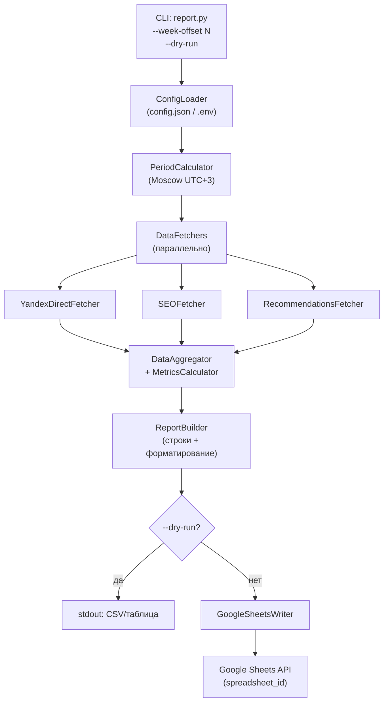

# Design Document: weekly-report-sheet

## Overview

`weekly-report-sheet` — Python-скрипт (`report.py`), который автоматически создаёт новую вкладку в существующей Google Таблице с еженедельным отчётом по рекламным каналам. Скрипт собирает данные из Яндекс Директ API, а также из заглушек/адаптеров для SEO и Рекомендаций, вычисляет производные метрики и записывает структурированный лист с форматированием.

**Ключевые характеристики:**
- Запуск: `python report.py [--week-offset N] [--dry-run]`
- Целевая таблица: `https://docs.google.com/spreadsheets/d/1TMa7NMknshntaQE-Dgmr-Trjk3pQxvY_K1IyAYfjZ4A/`
- Каналы: Яндекс Директ (с детализацией по кампаниям), SEO, Рекомендации
- Метрики: Показы, Визиты, CTR, CPC, Лиды, Конверсия в Лид, CPA, Ц. Лиды, Конверсия в Ц. Лид, CPL, Расход

---

## Architecture

Скрипт построен по принципу **pipeline**: конфигурация → период → сбор данных → расчёт метрик → запись в Sheets.



**Слои:**

| Слой | Модуль | Ответственность |
|---|---|---|
| CLI | `report.py` | Разбор аргументов, точка входа, коды возврата |
| Config | `config.py` | Чтение и валидация Config_File |
| Period | `period.py` | Вычисление Report_Period, форматирование |
| Fetchers | `fetchers/` | Получение сырых данных из источников |
| Metrics | `metrics.py` | Расчёт производных метрик, half-up округление |
| Report | `report_builder.py` | Сборка строк отчёта, форматирование ячеек |
| Writer | `sheets_writer.py` | Запись в Google Sheets API, retry-логика |
| Logger | `logger.py` | Структурированное логирование в stderr |

---

## Components and Interfaces

### ConfigLoader (`config.py`)

```python
@dataclass
class AppConfig:
    spreadsheet_id: str          # 20–60 символов
    credentials_path: str        # путь к JSON-ключу Service Account
    yandex_direct_client_id: str
    yandex_direct_token: str

def load_config(path: str = "config.json") -> AppConfig:
    """Читает Config_File, валидирует обязательные поля.
    Raises ConfigError(code=2) при отсутствии/пустых полях."""
```

### PeriodCalculator (`period.py`)

```python
@dataclass
class ReportPeriod:
    start: date   # понедельник
    end: date     # воскресенье

def calculate_period(week_offset: int = 0) -> ReportPeriod:
    """Вычисляет период по московскому времени (UTC+3).
    week_offset: 0 = текущая неделя, 1 = прошлая, ...
    Raises ValueError при week_offset вне [0, 52]."""

def format_tab_name(period: ReportPeriod) -> str:
    """Возвращает строку вида 'ДД.ММ–ДД.ММ' (≤11 символов)."""

def format_header_date(period: ReportPeriod) -> str:
    """Возвращает строку вида 'ДД.ММ.ГГГГ–ДД.ММ.ГГГГ'."""
```

### DataFetchers (`fetchers/`)

Каждый фетчер реализует общий протокол:

```python
class ChannelData(TypedDict):
    channel: str                    # "Яндекс Директ" | "SEO" | "Рекомендации"
    impressions: int
    visits: int
    leads: int
    target_leads: int
    spend: Decimal
    campaigns: list[CampaignData]   # пусто для SEO/Рекомендаций

class CampaignData(TypedDict):
    name: str
    impressions: int
    visits: int
    leads: int
    target_leads: int
    spend: Decimal

class DataFetcher(Protocol):
    def fetch(self, period: ReportPeriod) -> ChannelData: ...
```

**YandexDirectFetcher** — обращается к Яндекс Директ API (Reports API v5), запрашивает статистику по кампаниям за период. Реализует retry (3 попытки, 5 сек интервал) для сетевых ошибок и HTTP 5xx.

**SEOFetcher / RecommendationsFetcher** — адаптеры, читающие данные из конфигурируемого источника (CSV, API или заглушка). Интерфейс идентичен.

### MetricsCalculator (`metrics.py`)

```python
DASH = "—"

def calc_ctr(visits: int, impressions: int) -> str:
    """(visits / impressions) * 100, 2 знака, half-up. Возвращает DASH при impressions=0."""

def calc_cpc(spend: Decimal, visits: int) -> str:
    """spend / visits, 0 знаков, half-up. Возвращает DASH при visits=0."""

def calc_cpa(spend: Decimal, leads: int) -> str:
    """spend / leads, 0 знаков, half-up. Возвращает DASH при leads=0."""

def calc_cpl(spend: Decimal, target_leads: int) -> str:
    """spend / target_leads, 0 знаков, half-up. Возвращает DASH при target_leads=0."""

def calc_conv_lead(leads: int, visits: int) -> str:
    """(leads / visits) * 100, 2 знака, half-up. Возвращает DASH при visits=0."""

def calc_conv_target(target_leads: int, leads: int) -> str:
    """(target_leads / leads) * 100, 2 знака, half-up. Возвращает DASH при leads=0."""
```

Все функции используют `decimal.ROUND_HALF_UP` через модуль `decimal` стандартной библиотеки Python.

### ReportBuilder (`report_builder.py`)

Собирает список строк (`list[list[Any]]`) для записи в Sheets:

- Строка 1 (A1): дата отчёта `ДД.ММ.ГГГГ–ДД.ММ.ГГГГ`
- Строки 2–3: пустые (резерв)
- Строка 4: заголовки столбцов
- Строка 5: Summary_Row (Итого)
- Строки 6+: данные по каналам и кампаниям

### GoogleSheetsWriter (`sheets_writer.py`)

```python
class GoogleSheetsWriter:
    def __init__(self, config: AppConfig): ...

    def write_report(self, tab_name: str, rows: list[list[Any]],
                     bold_rows: list[int]) -> str:
        """Создаёт/пересоздаёт вкладку, записывает данные, применяет форматирование.
        Возвращает URL таблицы. Перемещает лист на позицию 0."""
```

Использует `google-api-python-client` и `google-auth`. Операции:
1. `spreadsheets.get` — проверка существования листа
2. `spreadsheets.batchUpdate` — удаление старого листа (если есть) + создание нового на позиции 0
3. `spreadsheets.values.batchUpdate` — запись данных
4. `spreadsheets.batchUpdate` — применение форматирования (bold, number formats)

---

## Data Models

### Конфигурация

```python
# config.json (пример)
{
  "spreadsheet_id": "1TMa7NMknshntaQE-Dgmr-Trjk3pQxvY_K1IyAYfjZ4A",
  "credentials_path": "service_account.json",
  "yandex_direct_client_id": "...",
  "yandex_direct_token": "..."
}
```

### Внутренняя модель строки отчёта

```python
@dataclass
class ReportRow:
    channel: str           # название канала или кампании
    impressions: int
    visits: int
    ctr: str               # "1,10%" или "—"
    cpc: str               # "р. 13" или "—"
    leads: int
    conv_lead: str         # "2,50%" или "—"
    cpa: str               # "р. 400" или "—"
    target_leads: int
    conv_target: str       # "80,00%" или "—"
    cpl: str               # "р. 500" или "—"
    spend: Decimal         # сырое значение для агрегации
    is_bold: bool = False  # True для заголовков каналов и итого
    is_campaign: bool = False  # True для строк кампаний
```

### Порядок столбцов (строка 4)

| # | Заголовок | Тип значения |
|---|---|---|
| A | Канал | str |
| B | Показы | int |
| C | Визиты | int |
| D | CTR | str (%) |
| E | CPC | str (р.) |
| F | Лиды | int |
| G | Конверсия в Лид | str (%) |
| H | CPA | str (р.) |
| I | Ц. Лиды | int |
| J | Конверсия в Ц. Лид | str (%) |
| K | CPL | str (р.) |
| L | Расход | Decimal |

---

## Correctness Properties

*A property is a characteristic or behavior that should hold true across all valid executions of a system — essentially, a formal statement about what the system should do. Properties serve as the bridge between human-readable specifications and machine-verifiable correctness guarantees.*

### Property 1: Форматирование периода — round trip

*For any* корректной даты понедельника, форматирование в строку вкладки (`format_tab_name`) и обратный парсинг должны возвращать исходные даты начала и конца периода без потери информации.

**Validates: Requirements 2.4**

---

### Property 2: Смещение недели сдвигает период ровно на N×7 дней

*For any* значения `week_offset` в диапазоне [0, 52], период, вычисленный с `week_offset = N`, должен начинаться ровно на `N × 7` дней раньше периода с `week_offset = 0`.

**Validates: Requirements 2.2**

---

### Property 3: Прочерк при нулевом знаменателе для любой производной метрики

*For any* набора входных данных, где знаменатель любой из производных метрик (CTR, CPC, CPA, CPL, Конверсия в Лид, Конверсия в Ц. Лид) равен нулю, соответствующая функция расчёта должна возвращать строку `"—"` независимо от значения числителя.

**Validates: Requirements 6.7**

---

### Property 4: Агрегация Summary_Row сохраняет суммы абсолютных метрик

*For any* набора строк каналов, сумма значений Показы, Визиты, Лиды, Ц. Лиды и Расход в Summary_Row должна точно равняться арифметической сумме соответствующих значений по всем строкам каналов.

**Validates: Requirements 4.3**

---

### Property 5: Производные метрики Summary_Row вычисляются из агрегированных абсолютных значений

*For any* набора строк каналов, производные метрики (CTR, CPC, CPA, CPL, конверсии) в Summary_Row должны быть вычислены из суммарных абсолютных значений всех каналов, а не как среднее арифметическое производных метрик отдельных каналов.

**Validates: Requirements 4.3**

---

### Property 6: Округление half-up для всех производных метрик

*For any* пары (числитель, знаменатель) с ненулевым знаменателем, результат расчёта любой производной метрики должен совпадать с результатом `Decimal(числитель) / Decimal(знаменатель)`, округлённым по правилу `ROUND_HALF_UP` до соответствующего числа знаков (2 знака для CTR, Конверсий; 0 знаков для CPC, CPA, CPL).

**Validates: Requirements 6.1, 6.2, 6.3, 6.4, 6.5, 6.6**

---

### Property 7: Валидация week_offset отклоняет значения вне диапазона [0, 52]

*For any* целого числа `N` вне диапазона [0, 52], функция вычисления периода должна сигнализировать об ошибке (raise ValueError или аналог), не возвращая никакого периода.

**Validates: Requirements 2.3**

---

### Property 8: Строки кампаний — подмножество данных канала

*For any* канала Яндекс Директ с одной или несколькими кампаниями, сумма абсолютных метрик (Показы, Визиты, Лиды, Ц. Лиды, Расход) по всем строкам кампаний должна равняться значениям в строке-заголовке этого канала.

**Validates: Requirements 5.1, 5.2**

---

### Property 9: Валидация конфига перечисляет все отсутствующие поля

*For any* подмножества обязательных полей конфига (`spreadsheet_id`, `credentials_path`, `yandex_direct_client_id`, `yandex_direct_token`), отсутствующих или пустых в Config_File, сообщение об ошибке должно содержать названия именно этих полей — не больше и не меньше.

**Validates: Requirements 1.2, 1.5, 9.5**

---

### Property 10: Retry выполняется ровно 3 раза при сетевых ошибках

*For any* источника данных, который всегда возвращает сетевую ошибку или HTTP 5xx, инструмент должен выполнить ровно 3 попытки запроса (не 2, не 4) перед завершением с кодом возврата 1.

**Validates: Requirements 8.3, 8.4**

---

### Property 11: Валидация spreadsheet_id по длине

*For any* строки длиной менее 20 или более 60 символов в поле `spreadsheet_id`, валидация конфига должна отклонить её с кодом возврата 2.

**Validates: Requirements 9.4**

---

## Error Handling

### Коды возврата

| Код | Ситуация |
|---|---|
| 0 | Успешное завершение |
| 1 | Ошибка источника данных (сетевая, HTTP 5xx, исчерпаны retry) |
| 2 | Ошибка конфигурации, валидации, авторизации (без retry) |

### Стратегия retry

Применяется только к сетевым ошибкам и HTTP 5xx от внешних API (Яндекс Директ, Google Sheets):
- Максимум 3 попытки
- Интервал между попытками: 5 секунд (фиксированный)
- После исчерпания попыток: лог + exit code 1

### Логирование

Все записи в stderr в формате:
```
2025-04-07T10:00:00+03:00 [START] report.py started, period=30.03–05.04.2025
2025-04-07T10:00:05+03:00 [SUCCESS] Sheet '30.03–05.04' created
2025-04-07T10:00:05+03:00 [END] status=SUCCESS
```

При ошибке:
```
2025-04-07T10:00:03+03:00 [ERROR] source=YandexDirect type=ConnectionError message="..."
2025-04-07T10:00:03+03:00 [END] status=FAILURE
```

### Обработка ошибок конфигурации

```python
class ConfigError(Exception):
    def __init__(self, missing_fields: list[str]):
        self.missing_fields = missing_fields
        super().__init__(f"Missing or empty fields: {', '.join(missing_fields)}")
```

---

## Testing Strategy

### Подход

Используется **двойная стратегия**: unit-тесты для конкретных примеров и граничных случаев + property-based тесты для универсальных свойств.

### Property-Based Testing

Библиотека: **[Hypothesis](https://hypothesis.readthedocs.io/)** (Python).

Каждый property-тест запускается минимум **100 итераций** (настройка `@settings(max_examples=100)`).

Тег формата: `# Feature: weekly-report-sheet, Property N: <текст свойства>`

| Property | Тест | Что генерируется |
|---|---|---|
| P1: round trip периода | `test_period_format_roundtrip` | случайные даты понедельников |
| P2: смещение недели | `test_week_offset_shift` | `week_offset` ∈ [0, 52] |
| P3: прочерк при нуле | `test_dash_on_zero_denominator` | наборы метрик с нулевыми знаменателями |
| P4: агрегация Summary | `test_summary_row_aggregation` | списки строк каналов |
| P5: производные из агрегата | `test_summary_derived_from_totals` | списки строк каналов |
| P6: half-up округление | `test_metrics_rounding_halfup` | пары (числитель, знаменатель) для всех 6 метрик |
| P7: валидация offset | `test_invalid_week_offset` | целые числа вне [0, 52] |
| P8: кампании ⊆ канал | `test_campaign_sum_equals_channel` | списки кампаний с метриками |
| P9: валидация конфига | `test_config_missing_fields_listed` | подмножества обязательных полей |
| P10: retry ровно 3 раза | `test_retry_exactly_three_times` | мок источника данных с ошибкой |
| P11: валидация spreadsheet_id | `test_spreadsheet_id_length_validation` | строки длиной < 20 и > 60 |

### Unit-тесты

- Корректное чтение `config.json` с валидными и невалидными данными
- Форматирование дат (`format_tab_name`, `format_header_date`)
- Конкретные примеры расчёта метрик (CTR=1.10%, CPC=13р. и т.д.)
- Создание/пересоздание вкладки (мок Google Sheets API)
- `--dry-run`: вывод в stdout без вызова Sheets API
- Retry-логика: 3 попытки с интервалом 5 сек (мок time.sleep)
- Коды возврата: 0, 1, 2 для разных сценариев

### Интеграционные тесты

- End-to-end запуск с реальным (тестовым) spreadsheet_id
- Проверка структуры созданного листа: позиция 0, имя вкладки, строка 4 — заголовки

### Структура тестов

```
tests/
  unit/
    test_config.py
    test_period.py
    test_metrics.py
    test_report_builder.py
    test_sheets_writer.py
  property/
    test_period_properties.py
    test_metrics_properties.py
    test_aggregation_properties.py
  integration/
    test_e2e.py
```
